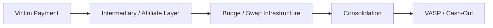
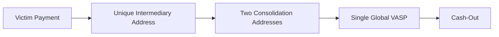

# Akira — Blockchain and Financial Intelligence

## Overview

Public on-chain analysis included in the collected research describes a clear evolution in how Akira receives, consolidates, launders and cashes out ransomware proceeds.

The November 2025 joint advisory reports approximately **USD 244.17 million in ransomware proceeds as of late September 2025**. This is the authorities' dated aggregate, not a September 2026 balance, independently reproduced sum of this repository's 21 payment addresses, or net operator profit. It cannot be added to provider-specific laundering estimates, which may overlap. [A01](../References.md#a01)

TRM divides its observations into four phases, bounded by its **2026-03-20** profile. The diagrams below summarize that provider account; they are not independently reconstructed transaction graphs. [A02](../References.md#a02)



The exact flow varies by phase.

## Blockchain Attribution and Visibility Limitations

Identifying cryptocurrency addresses associated with Akira is inherently difficult and should be approached with caution.

Most Bitcoin addresses that can be publicly associated with Akira are **victim payment addresses**. These may have been provided by Akira operators or affiliates during ransom negotiations and later documented by researchers, giving analysts a comparatively strong basis for associating the address with a particular Akira incident.

However, these addresses should **not** be interpreted as Akira's primary treasury wallets, long-term operational wallets or a complete map of wallets controlled by the organization.

After a ransom payment is received, proceeds can move through multiple layers of financial obfuscation, including:

- intermediary wallets;
- consolidation addresses;
- cross-chain bridges;
- decentralized finance (DeFi) infrastructure;
- asset swaps;
- centralized exchanges and other virtual asset service providers (VASPs);
- mixers and privacy-enhancing services;
- services such as Tornado Cash;
- infrastructure such as Chainflip, WanChain and Defiway.

These mechanisms make downstream tracing progressively more uncertain. A wallet several hops away from a known victim payment may belong to an Akira administrator, an affiliate, a third-party laundering provider, a VASP, another ransomware ecosystem or an unrelated counterparty.

For this reason, this repository uses the term **Akira-associated payment address** rather than claiming that every listed wallet "belongs to Akira."

> **Victim payment address ≠ Akira treasury wallet.**

As of the 2026-09-10 review, the public information collected for this repository does not provide sufficient visibility to confidently identify Akira's complete core treasury infrastructure.

This limitation is particularly relevant because Akira's laundering process appears to have become increasingly standardized over time. Intermediary addresses, bridges, consolidation infrastructure and eventual VASP cash-out can obscure both the relationship between individual victim payments and the final beneficiary and the point at which administrators and affiliates divide proceeds.

Blockchain attribution in this repository therefore distinguishes between:

1. **documented payment addresses** — directly associated with reported Akira ransom activity;
2. **downstream infrastructure** — identified through tracing but requiring separate analytical assessment;
3. **service infrastructure** — bridges, exchanges, mixers or other third parties that may process Akira funds without being controlled by Akira.

The currently collected publicly reported payment addresses are maintained in [`../iocs/blockchain-addresses.md`](../iocs/blockchain-addresses.md).

## Phase I — 2023

Early Akira payment flows reportedly provided the clearest visibility into possible affiliate structure.

Observed patterns included:

- reuse of intermediary addresses;
- wallet clusters receiving funds from multiple victim payments;
- common cash-out points;
- repeatable transactional behavior that could help distinguish likely affiliates.

### Assessment

The relative diversity of transaction paths is consistent with greater affiliate-level visibility or autonomy during the early period.

## Phase II — Early to Mid-2024

Akira reportedly shifted toward a more standardized laundering workflow using **WanChain**.

Most victim payments were described as being routed through a single WanChain address and later dispersed to multiple global VASPs for cash-out.

### Assessment

This represents a move away from easily distinguishable affiliate-level clustering toward more centralized or standardized financial infrastructure.

## Phase III — Late 2024

The operation reportedly changed again, routing victim proceeds through the **Defiway** bridge.

During this period, **Fog ransomware** was observed using the same laundering approach.

### Assessment

The overlap supports the possibility of cooperation, common service providers, shared affiliates or common financial infrastructure. Shared bridge usage alone does not prove organizational identity.

## Phase IV — August 2025 to March 20, 2026

The collected research describes a more standardized process:



Key observations:

- each victim payment passes through a unique intermediary address;
- funds are aggregated across two consolidation addresses;
- the reporting identifies **HTX** as the primary cash-out destination;
- admin/affiliate revenue sharing appears to occur only after funds reach the shared VASP address, making the split opaque on-chain;
- cash-out may occur on the same day or within approximately 36 hours of payment receipt.

### Analytical Assessment

**Moderate confidence:** the increasing standardization of Akira's laundering process may indicate greater centralization of treasury or cash-out operations.

### Alternative Explanations

The same observable pattern could also be produced by:

- a third-party laundering service used by multiple affiliates;
- common operational guidance imposed on affiliates;
- a shared VASP account structure without centralized treasury control.

The available on-chain information does not conclusively distinguish between these explanations.

## Deviations from Phase IV

The collected research also describes isolated transactions that diverged from the standardized Phase IV pattern:

1. victim funds routed through **Chainflip** cross-chain swaps;
2. funds subsequently deposited in full into **Tornado Cash**.

Possible interpretations include:

- affiliate-level deviation from standard procedures;
- experimentation with alternative laundering paths;
- early evidence of a new laundering phase.

## Akira ↔ Fog

Fog ransomware reportedly used the same Defiway laundering infrastructure during Phase III.

```text
Akira ──┐
        ├── Defiway laundering infrastructure
Fog   ──┘
```

This strengthens evidence of an operational or service-level relationship but is not definitive evidence of shared ownership.

## Akira ↔ Frag

The collected research states that TRM assesses Frag may represent an extension of Akira.

Supporting on-chain observations include:

- shared two-address wallet clustering;
- use of the same bridge;
- use of the same payment service;
- temporal overlap with financial infrastructure associated with Akira;
- additional overlap between Frag and Fog.

## Cash-Out Timing

The notes also state that Akira and several other ransomware operations, including **Anubis, Lumos and INC**, have been observed cashing out within the same day or within approximately 36 hours of payment receipt.

This is useful for temporal analysis but should be treated as supporting context rather than an attribution indicator by itself.

## Intelligence Gaps

Further analysis would benefit from:

- victim payment addresses with reliable attribution;
- complete transaction graphs for each phase;
- timestamp correlation between victim payment, bridge activity and VASP deposit;
- identification of consolidation addresses;
- visibility beyond exchange deposit addresses;
- information on whether admin/affiliate splits occur off-chain inside VASP accounts;
- evidence distinguishing operator-controlled laundering from third-party laundering-as-a-service.

## Analyst Note

Blockchain evidence is strongest when combined with non-financial CTI. Shared wallets, bridges or exchanges should be evaluated alongside malware, infrastructure, timing, victimology and affiliate behavior before drawing organizational conclusions.

## Independent Corroboration and Financial-Service Disruption

Chainalysis independently reports Akira and Fog flows to the same no-KYC exchange in its February 2025 review of 2024. This corroborates **shared cash-out behavior**, but does not independently reproduce TRM's exact Defiway cluster, prove identical private-key control, or identify all affiliates. A common broker or exchange is an alternative explanation. [A25](../References.md#a25)

On June 11, 2026, Europol announced the disruption of AudiA6, a suspected laundering service associated with approximately **EUR 336 million during 2022–2025**. TRM separately estimates that its identified AudiA6 infrastructure received **USD 386,200 attributable to Akira** and **USD 7.1 million attributable to Qilin**. The operation and the actor-level flow estimates have different sources; the aggregate is neither Akira revenue nor the value of assets seized. **Moderate Confidence** in the actor/service connection: provider attribution with no transaction-level replication in this dossier. No AudiA6 address is promoted to an Akira treasury address. [Europol F04](../References.md#f04), [TRM F03](../References.md#f03)

## Regulatory and Judicial Review

See the shared [dated financial-source review](../../financial-source-review.md) for OFAC/SDN screening, official actions, provider coverage and retrieval limitations. French OFAC, named in AA24-109A, is a police office and must not be confused with US Treasury OFAC.

US Treasury removed Tornado Cash sanctions on **2025-03-21**. Its historical designation must not be carried forward automatically to the later TRM-reported Akira transactions. Neither the delisting nor interaction with a mixer identifies the person controlling the funds. [F05](../References.md#f05), [F06](../References.md#f06)

The May 2026 Zolotarjovs sentence concerns a money-laundering/wire-fraud conspiracy in a historical multi-brand organization. The release contains no validated Akira payment or seizure address for this inventory. Its organization-wide payment figures are not Akira-only totals. [A24](../References.md#a24)

## Multi-Chain Research and Next Collection Priorities

The validated payment inventory is Bitcoin, but TRM's bridge/swap and Tornado Cash reporting makes Ethereum and cross-chain activity relevant. For each proposed bridge hop, preserve input transaction, output transaction, network IDs, token contract, units, time and the mechanism establishing continuity. Equal value and nearby timestamps alone are insufficient. No TRON/USDT or Ethereum address is presently validated here as a direct Akira victim payment address.

Prioritize: (1) transaction identifiers behind TRM's two consolidation addresses; (2) bridge-event evidence distinguishing swaps from pooled services; (3) incident-specific payment instructions and dates; (4) exchange records or judicial exhibits distinguishing deposit accounts from beneficial ownership. Exchange-internal transfers and privacy mechanisms can create visibility discontinuities; confidence does not necessarily decrease at every hop if new independent evidence restores it.
