# Akira — Operations and Attack Lifecycle

Akira does not follow a single immutable intrusion chain. As a RaaS operation, individual affiliates may differ in tooling and execution. Nevertheless, the collected reporting shows a recurring operational pattern.

```mermaid
flowchart LR
    A[External Recon / Targeting] --> B[Initial Access]
    B --> C[Foothold / Execution]
    C --> D[Credential Access]
    D --> E[AD & Network Discovery]
    E --> F[Privilege Expansion]
    F --> G[Lateral Movement]
    G --> H[Defense Evasion]
    H --> I[Persistence / C2]
    I --> J[Collection & Staging]
    J --> K[Exfiltration]
    K --> L[Recovery Inhibition]
    L --> M[Ransomware Deployment]
    M --> N[Extortion]
```



## 1. External Reconnaissance

Collected reporting associates Akira-linked activity with tools including:

- Masscan;
- ReconFTW (found on an operator server; Stairwell observed apparent testing rather than established victim use);
- Advanced IP Scanner / Advanced Port Scanner;
- SoftPerfect NetScan.

The objective is to identify externally reachable services and, after compromise, enumerate internal hosts, ports, shares and network services.

## 2. Initial Access

Observed initial-access paths include:

### Valid credentials and remote services
Akira affiliates have been reported abusing existing credentials to authenticate to:

- VPN infrastructure;
- RDP;
- SSH or other remote-access services.

Credentials may be previously compromised, obtained from criminal marketplaces or tested through brute force/password spraying. Environments without effective MFA are particularly exposed to this approach.

### Exploitation of public-facing infrastructure
The collected research includes exploitation or targeting of vulnerable products from:

- Cisco ASA / FTD;
- Fortinet FortiOS / FortiClient;
- SonicWall SonicOS SSL-VPN;
- Veeam Backup & Replication;
- VMware vSphere / ESXi.

Specific CVEs are maintained in [`../technical/vulnerabilities.md`](../technical/vulnerabilities.md).

### Phishing
The ATT&CK material collected for Akira also includes spearphishing links and malicious attachments as reported initial-access methods.

## 3. Execution and Foothold

Akira-associated activity makes extensive use of:

- PowerShell;
- Windows Command Shell;
- Visual Basic scripts;
- WMI;
- service execution;
- PsExec / PSEXESVC;
- Cobalt Strike in some intrusions.

This allows malicious activity to blend with normal administrative behavior and reduces reliance on actor-specific binaries.

## 4. Credential Access

Credential theft is a major part of reported Akira intrusions.

Observed methods include:

- LSASS memory dumping;
- SAM extraction;
- NTDS.dit dumping from domain controllers;
- browser credential theft;
- Windows Credential Manager / DPAPI access;
- password spraying and brute force.

Reported tools and techniques include:

- Mimikatz;
- LaZagne;
- DonPAPI;
- NetExec;
- `comsvcs.dll` MiniDump;
- Veeam credential extraction tooling.

Example reported command:

```powershell
rundll32.exe C:\Windows\System32\comsvcs.dll, MiniDump ((Get-Process lsass).Id) C:\Windows\Temp\lsass.dmp full
```

Credential access can then enable lateral movement, pass-the-hash activity and escalation into privileged domain accounts.

## 5. Discovery and Active Directory Reconnaissance

Akira affiliates conduct extensive discovery before the impact phase.

### Network discovery
Observed tools include:

- Advanced IP Scanner;
- Advanced Port Scanner;
- SoftPerfect NetScan;
- Masscan.

### Active Directory and share discovery
Observed tooling includes:

- BloodHound;
- SharpHound;
- ShareFinder;
- SharpShares;
- AdFind;
- ldapdomaindump;
- Snaffler.

Reported native commands include:

```cmd
nltest /dclist:
nltest /DOMAIN_TRUSTS
net group "Domain admins" /dom
net localgroup "Administrators" /dom
tasklist
```

The ransomware itself has also been described as performing logical-drive enumeration through `GetLogicalDriveStrings()` and user/process-related enumeration through `WTSEnumerateProcessesW`.

## 6. Privilege Escalation

Privilege expansion may follow credential theft or exploitation of vulnerable software.

Collected reporting includes:

- abuse of privileged credentials recovered from LSASS, SAM, NTDS.dit, browsers or credential stores;
- Veeam-related vulnerabilities;
- kernel-level defense impairment using **POORTRY** and vulnerable signed drivers. POORTRY is malicious driver tooling; it should not be treated as a legitimate driver solely because it was signed. The privilege required to load a driver must be distinguished from any additional elevation it enables.

Credential dumping should be treated as **Credential Access**; privilege escalation occurs when the resulting credentials or exploits provide higher-privileged access.

## 7. Lateral Movement

Observed mechanisms include:

- RDP;
- SSH;
- Impacket (`wmiexec.py`, `atexec.py`);
- PsExec / PSEXESVC;
- Cobalt Strike;
- remote management software.

Akira-associated activity has also used RMM products such as AnyDesk, RustDesk, Radmin, TeamViewer, LogMeIn, MeshAgent and Level.io.

## 8. Defense Evasion

A recurring feature of Akira intrusions is the effort to weaken endpoint and network defenses before the final impact phase.

Reported techniques include:

- terminating antivirus processes;
- uninstalling or disabling EDR;
- modifying firewall rules;
- PowerShell and LOLBin abuse;
- DLL side-loading;
- BYOVD;
- use of obfuscation/packers such as HeartCrypt.

Reported tooling includes:

- PowerTool;
- KillAV;
- POORTRY;
- STONESTOP;
- vulnerable Zemana-related drivers;
- `churchill_driver.sys` / `fidget.sys`.

### Safe Mode EDR bypass attempt

A recent incident in the collected reporting described an Akira affiliate rebooting a victim host into **Safe Mode with Networking** after gaining access through an exposed SonicWall VPN. The objective was to prevent normal EDR and Microsoft Defender protections from loading.

The tactic disabled the defensive software but also caused the Akira process tree to fail because of an out-of-memory condition. By that point, however, credentials and file shares had already been exfiltrated, leaving the victim exposed to data-extortion pressure even without successful encryption.

## 9. Persistence and Remote Access

Reported persistence mechanisms include:

- creating local administrative users;
- creating or manipulating domain accounts;
- maintaining RMM access;
- using SystemBC as a RAT;
- remote administration over SSH;
- tunneling through legitimate services.

## 10. Command and Control / Tunneling

Akira-associated activity has used:

- Ngrok;
- Cloudflare Tunnel / Cloudflared;
- SystemBC;
- MobaXterm;
- Cobalt Strike;
- legitimate RMM software.

These tools can hide malicious communications within otherwise legitimate HTTPS or remote-management traffic.

## 11. Collection and Exfiltration

Before encryption, Akira affiliates frequently collect, compress and transfer sensitive information.

Observed tooling includes:

- WinRAR;
- 7-Zip;
- Rclone;
- WinSCP;
- FileZilla;
- PuTTY / PSCP;
- MEGA;
- temporary file-hosting services such as `temp[.]sh`.

The collected notes also reference a redacted `temp.sh/.../all.txt` path as evidence associated with exfiltrated victim data.

## 12. Recovery Inhibition

Akira ransomware attempts to reduce recovery options by deleting Volume Shadow Copies and affecting filesystem snapshots.

Example reported PowerShell:

```powershell
Get-WmiObject Win32_Shadowcopy | Remove-WmiObject
```

`vssadmin.exe` has also been associated with deletion of VSS copies.

## 13. Ransomware Deployment and Impact

Akira ransomware has been observed being remotely deployed with PsExec/PSEXESVC.

The impact stage may include:

- encryption of Windows or Linux systems;
- deletion of shadow copies;
- interruption of access to business data;
- double extortion using previously exfiltrated information.

The operation does not necessarily require successful encryption: data theft alone may provide sufficient leverage for extortion.

## Operational Detection Principle

No single tool listed above uniquely identifies Akira. Many are legitimate administrative products or common offensive-security utilities. Stronger attribution and hunting hypotheses should rely on combinations of behavior, temporal sequence, ransomware artifacts, infrastructure and corroborating intelligence.

## Evidence Anchors for the Lifecycle

The credential, discovery, remote-access, exfiltration and impact inventory above is primarily supported by [AA24-109A, pp. 5–12 (A01)](../References.md); [Stairwell (A12)](../References.md) supports the Fortinet-server activity, and [Arctic Wolf (A17)](../References.md) provides independent IR observations. Tools merely available to an operator are not automatically observed techniques. SharePoint collection and specific DonPAPI/DPAPI procedures in older notes remain uncorroborated at incident level.

## Additional Case Evidence

**Darktrace, incident 2025-08-20 — Moderate Confidence in Akira linkage.** The company observed unusual WinRM with a Ruby client, ICertPassage requests followed by PKINIT and U2U ticket activity, interpreting the sequence as UnPAC-the-hash. This is richer evidence than generic “Kerberos use”; it does not identify a particular AD CS exploit class. Its mention of RDP to an “ESXi device” is an unresolved asset/protocol ambiguity, not evidence of native ESXi RDP support. IP roles are in [IP Addresses](../iocs/ip-addresses.md). [A10](../References.md#a10)

**Huntress, published August 2026.** Newly documented artifacts include full-property AD user/computer exports, S3 upload with s5cmd and registration of AnyDesk under SafeBoot before an msconfig-driven reboot. The missing EDR visibility was temporary; exfiltration preceded failed encryption. [A11](../References.md#a11)

**Analytical implication — High Confidence:** a missing encryption alert does not close an extortion incident. Correlate VPN identity, server activity and egress; preserve appliance and hypervisor logs outside their own administrative boundary. File-share encryption from an unmanaged host can make the first protected endpoint look like a victim of remote writes rather than the source of execution.

## Negotiation and Organizational Signals

KELA's 2023 sample describes negotiators referring price decisions to other personnel, separate pricing for decryption and data deletion, and staged movement from naming victims to publishing data. Demands varied from $105,000 to $3.7 million in that sample. These are negotiation observations, not proof of a formal management chart or present-day tariff. Some chats persisted despite promised deletion. [A15](../References.md#a15)

**Assessment — Moderate Confidence:** specialization in negotiation is plausible; scripted bargaining or affiliate delegation can produce similar communications. A deletion log or guarantee is an adversary assertion and cannot establish that all stolen copies were destroyed. Note-level evidence is catalogued in [Ransom Notes](../ransom-notes/Ransom-Notes.md).
