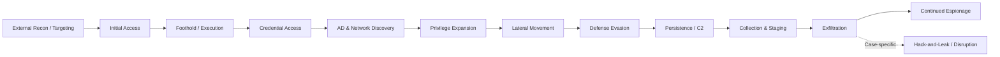

# APT28 — Operations and Attack Lifecycle

**Presentation reviewed:** 2026-09-15.

APT28 does not follow a single immutable intrusion chain. The phases organize published espionage procedures; alternative access paths and sample capabilities are identified separately. **Observed** means observed by the reporting investigator. Reviewed **2026-09-14**.

Email-only collection may bypass endpoint execution and lateral movement. The ransomware phases remain below for template compatibility; they are not implied by this diagram.

## 1. External Reconnaissance

Government, defense and diplomatic targeting is documented over many years. Secureworks analyzed shortened phishing links directed at selected accounts; target enumeration in that dataset is not a complete list of successful compromises.

Recent operations also select targets after compromising intermediaries. Router DNS collection provides visibility into downstream service requests, while HOOKEDGE's follow-on stage allows more responsive tasking for selected machines. This supports a distinction between broad acquisition of access and narrower intelligence collection.

A Spanish-government lure does not demonstrate compromise of that ministry. Similarly, a compromised household router may expose a traveling official without making that household the original intelligence target. Preserve lure identity, infrastructure ownership and final victim as separate entities.

## 2. Initial Access

### Valid credentials and remote services

The 2021 joint advisory describes distributed credential attacks against enterprise and cloud environments. Kubernetes was part of the attack infrastructure; that does not mean every victim operated Kubernetes. Public-facing authentication logs can reveal guessing and subsequent successful access, but a success alone does not prove how the password was acquired.

Volexity's February 2022 case illustrates an access-control boundary: internet services required MFA, but the targeted enterprise Wi-Fi accepted the recovered credentials. Compromised neighboring machines supplied radio proximity to remote operators. It was not a remote exploit of Wi-Fi encryption, and it did not require the operator to travel to the victim.

The 2025 logistics advisory also describes credential-based access. Review VPN, identity-provider and mail authentication together, including access arriving through residential or SOHO infrastructure.

### Exploitation of public-facing infrastructure

Separate at least three router roles:

- **2021 Cisco case:** reconnaissance and Jaguar Tooth deployment on vulnerable routers.
- **2024 EdgeRouter case:** APT28 repurposed already-compromised devices to support credential capture and proxy activity.
- **2024–2026 DNS case:** router DHCP/DNS modifications caused clients to consult malicious resolvers, enabling selected follow-on interception.

These are different chains. A router's presence in an IP list does not show that it hosted the same malware as another router population.

ANSSI documents repeated webmail targeting. For RoundPress, retain ESET's medium-confidence assessment alongside Proofpoint's distinct TA458 tracking; do not label every Roundcube or SOGo exploit as APT28.

### Phishing

Published paths include credential-harvesting links, macro documents, archive exploitation and crafted Outlook items. Phishing can lead directly to mailbox collection without installing a conventional RAT.

In Neusploit, localized RTF lures reached users in Ukraine, Slovakia and Romania. Zscaler observed selective payload delivery based on request characteristics and geography. A researcher receiving benign or empty content does not establish that the URL was harmless at the incident time.

Sekoia and ESET also contextualize government-themed messaging delivery in Ukraine. The message carrier is a delivery channel; using Signal does not imply a Signal platform exploit.

## 3. Execution and Foothold

Reported components include Windows command and PowerShell scripts, VBA projects, DLL loaders, modified Covenant implants and historical platform-specific backdoors. They serve different stages and should not be collapsed into one family.

NotDoor installation uses a legitimate OneDrive executable to load a malicious DLL and place an Outlook macro project. The executable's signature establishes its publisher, not the legitimacy of the directory or DLL loaded beside it.

Neusploit and PRISMEX analyses describe staged loading, image-contained data and COM-based persistence. An image hash or filename is only useful with its role, initiating process and campaign provenance. Do not open or execute a recovered artifact to validate an IOC match.

## 4. Credential Access

Different mechanisms expose different kinds of authentication material:

**Password guessing.** Published evidence: Distributed enterprise/cloud attacks Investigative distinction: A valid password does not prove MFA or conditional-access bypass.

**Outlook-triggered NTLM leakage.** Published evidence: CVE-2023-23397 investigation Investigative distinction: Captured Net-NTLMv2 material is not a plaintext password; separate capture, relay and later access.

**Browser-secret collection.** Published evidence: STEELHOOK in the logistics evidence Investigative distinction: Browser databases, encryption keys and resulting account use are distinct artifacts.

**On-host credential/token interception.** Published evidence: AUTHENTIC ANTICS Investigative distinction: Examine Outlook process activity, identity events and token reuse; password changes alone may not explain session invalidation.

**Router-mediated interception.** Published evidence: Microsoft 2026 case Investigative distinction: The described TLS interception presented invalid certificates; warning acceptance is a material precondition in Microsoft's account.

Credential access may recur throughout an intrusion. Distinguish theft of authentication material from the subsequent authority obtained by using it.

## 5. Discovery and Active Directory Reconnaissance

### Network discovery

Jaguar Tooth collects router information. That is network-device reconnaissance, not proof of enterprise domain enumeration. Modern host implants also gather identifying system data, which can support victim selection and tasking.

The public logistics advisory identifies internal reconnaissance and movement. Correlate queried assets with later authentication or access; a scanner name or isolated administrative command is insufficient.

### Active Directory and share discovery

GTIG's PROMPTSTEAL analysis documents runtime-generated discovery that includes system and domain information, followed by document collection. The analysis concerns a particular malware family and operation; it does not establish autonomous target selection or a fully automated intrusion lifecycle.

Historical Xagent modules and modern espionage implants support host and file collection. Domain enumeration, identifying a share, reading a file and transferring it out are separate stages. This dossier includes defensive telemetry descriptions rather than reproducing discovery or exploitation command sequences.

## 6. Privilege Escalation

Microsoft identifies GooseEgg as a post-compromise tool exploiting CVE-2022-38028. Its purpose is elevated execution after access has already been obtained. Persistence and credential-collection artifacts can accompany it, but their presence does not by itself prove a successful exploit.

Recovered credentials may separately provide more privileged accounts. In the hotel investigation, credential interception and SMB-based movement formed part of the observed chain. Do not infer kernel exploitation when account authority explains the access.

For triage, establish the original account, parent process, resulting security context and subsequent actions. The [vulnerability register](../technical/vulnerabilities.md) keeps local escalation separate from initial access.

## 7. Lateral Movement

The logistics advisory reports use of Windows remote-access and administration mechanisms, including tools with legitimate uses. Preserve source host, account, destination and service/process creation rather than relying on a product name.

FireEye's 2017 hotel campaign included EternalBlue-assisted movement and Responder activity. That historical observation does not demonstrate that the same exploit remains an APT28 default in 2026.

The nearest-neighbor case crosses an organizational boundary through Wi-Fi. Analyze wireless controller/RADIUS records and the compromised bridging host alongside endpoint logs; an internet-only perimeter view would omit the decisive path.

## 8. Defense Evasion

Published examples include legitimate-host process abuse, obfuscation, conditional execution, image-based concealment, selective payload delivery and removal of traces. Their purpose and effectiveness vary by sample.

AUTHENTIC ANTICS uses environmental keying and attempts to remove certain hooks. A sample that fails on a laboratory host is not necessarily inactive; its execution may depend on victim-specific data.

HOOKEDGE revisions include longer polling intervals and changes to execution/open-tracking behavior. Recorded Future offers sandbox and service-quota explanations as assessments, not observed internal planning.

### Safe Mode EDR bypass attempt

**No aplica / Not observed in the reviewed APT28 evidence.** The Akira/Qilin Safe Mode cases are not imported. APT28's documented evasion mechanisms are described above.

## 9. Persistence and Remote Access

Persistence mechanisms in the collected evidence include scheduled tasks, COM hijacking, Outlook macro startup and historical firmware modification. A mailbox-access campaign may instead collect information without installing a persistent endpoint component.

LoJax demonstrates why OS reinstallation is not a sufficient eradication test for a confirmed firmware infection. It does not justify assuming firmware compromise after every APT28 alert.

ESET describes simultaneous BeardShell and Covenant deployments using different providers. Investigate all access paths before declaring recovery; the removal of one cloud channel does not establish removal of its companion implant.

## 10. Command and Control / Tunneling

**Xagent / Xtunnel.** Role and scope: historical implant communications and network pivoting.

**Modified Covenant.** Role and scope: cloud-backed tasking; the provider changed across reported versions.

**BeardShell.** Role and scope: cloud-mediated PowerShell tasking.

**HEADLACE / HOOKEDGE.** Role and scope: scripted tasking and transfers using public web services.

**NotDoor.** Role and scope: email-triggered backdoor functions and output.

**Compromised routers.** Role and scope: relay, credential-capture or DNS functions depending on the case.

AUTHENTIC ANTICS is not a general remote-tasking backdoor: NCSC explicitly states it cannot receive C2 tasks. Its legitimate-service communications support credential/token exfiltration.

Filen, Icedrive, Koofr, pCloud and Microsoft services are legitimate providers. Investigate process ancestry, account/tenant, resource identifier, traffic cadence and data movement. A provider domain alone is not malicious infrastructure.

## 11. Collection and Exfiltration

The collection scope includes email, local documents and interactive user activity. The historical Xagent corpus and modern SlimAgent support keylogging and related surveillance; these are sample capabilities, not proof that every target was monitored in every way.

NotDoor can return data through email, while PROMPTSTEAL stages selected documents before transfer. Neither implies a ransomware extortion workflow.

For mailbox cases, examine changes to access permissions, authentication history and message access alongside endpoint artifacts. For cloud transfer, establish destination account/resource and successful transfer evidence. DNS resolution alone is not exfiltration, and a missing sent-mail copy does not demonstrate that no message was sent.

## 12. Recovery Inhibition

**No aplica to the ransomware recovery-inhibition phase.** The reviewed evidence does not establish an APT28-wide backup-destruction or shadow-copy-deletion playbook.

Trend reports a destructive command deleting files under a user profile in an October 2025 campaign branch. Preserve that observation as a case-specific destructive action; do not turn it into a backup-wiping or ransomware claim.

## 13. Ransomware Deployment and Impact

**No aplica to ransomware deployment.** Established outcomes include loss of confidentiality, unauthorized ongoing access and politically motivated publication. The DOJ distinguishes computer intrusion from later coordinated publication.

Potential destructive capability in PRISMEX-related reporting warrants incident-specific investigation. It does not connect APT28 to Akira, Qilin or LockBit, and it does not transfer Olympic Destroyer attribution from Unit 74455.

## Operational Detection Principle

Correlate identity, endpoint, mailbox, network-device and cloud evidence. Attribution follows a supported case assessment, not a single matching hash, legitimate tool or service domain. Use the [published detection collection](../detections/Detections.md) with its sensor and false-positive limitations.

## Evidence Anchors for the Lifecycle

The principal case anchors are separate government advisories and vendor investigations covering credential theft, edge-device abuse, mailbox collection and implant deployment.

They describe different victims, time windows and sensors. The combined lifecycle is an analytical organization of evidence, not a reconstructed single operation.

## Additional Case Evidence

**Dates:** a November 2024 publication can describe February 2022 access; a July 2025 attribution can describe malware seen in 2023. Keep these distinctions in incident matching.

**Exploit status:** Neusploit's observed use follows disclosure; Trend's separate infrastructure/zero-day discussion does not establish an observed pre-disclosure CVE-2026-21509 exploit in Zscaler's case.

**Disruption:** the FBI's April 2026 operation addressed a US router population. It is not an assertion that all worldwide access, stolen tokens or attacker-held data were removed.

## Negotiation and Organizational Signals

**No aplica to ransom negotiation, affiliate recruitment or builder panels.** The documented organizational signals are government attribution, named defendants' alleged roles, custom development and remote/close-access division of work. Public evidence does not establish a current contractor roster or open recruitment process.

The financial distinction is infrastructure expenditure versus extortion receipts. See [Blockchain](blockchain.md) and [Attribution](attribution.md).
