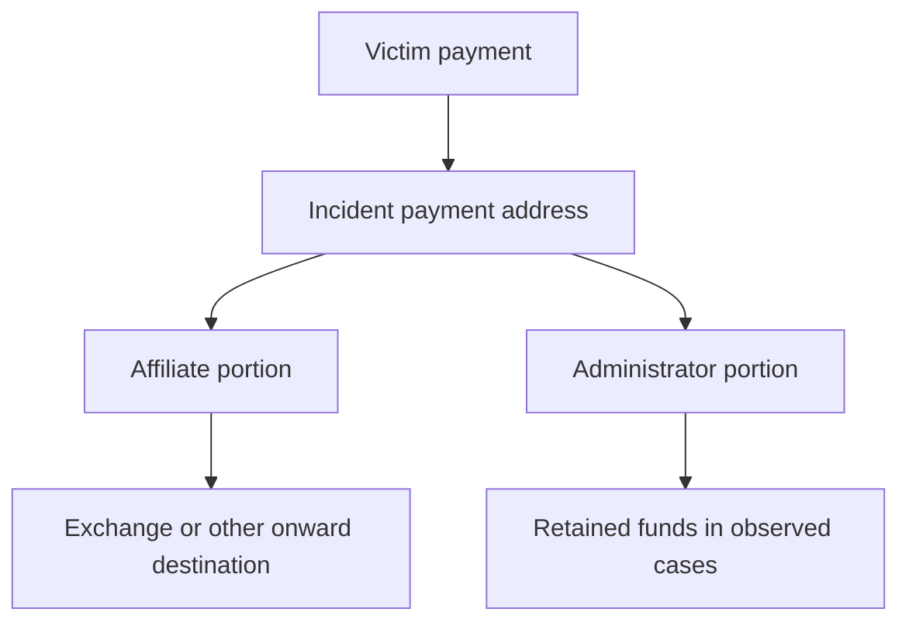

# LockBit — Blockchain and Financial Intelligence

**Presentation reviewed:** 2026-09-22.

## Overview

LockBit's financial model combines victim payments, affiliate revenue, developer commissions and purchases of criminal infrastructure. Public evidence includes official address designations, vendor transaction analysis and the May 2025 panel disclosure. These describe several financial roles, rather than one central wallet collecting every ransom.

The [address register](../iocs/blockchain-addresses.md) contains eleven officially attributed identifiers for Khoroshev and two affiliates, four separately classified hosting-provider identifiers, and one possible-impostor payment artifact. Bibliography and the claim-to-source mapping remain centralized in [References](../References.md#financial-analysis-provenance).

## Blockchain Attribution and Visibility Limitations

OFAC's 2024-05-07 notice identifies `bc1qvhnfknw852ephxyc5hm4q520zmvf9maphetc9z` with Dmitry Khoroshev. This is an official attribution to a named individual, not a claim that every LockBit victim paid this address.

Affiliate-controlled negotiation addresses, developer commission addresses and exchange deposits perform different functions. A vendor cluster expands on-chain visibility through analytical assumptions; its full membership cannot be reconstructed from a single public address.

### What an address identifies

An address is not a wallet, a person or a victim count. One wallet can generate many addresses, and a payment portal can retain unused destinations. A note or chat establishes that payment was requested at an address; a confirmed transaction establishes that funds arrived. Linking those funds to a particular victim requires the incident evidence as well.

Custodial deposit addresses add another layer. A service may control the keys while crediting a customer's internal account. The publicly attributed customer and the technical custodian can therefore be different entities. Subsequent pooled exchange transfers do not identify which customer ultimately withdrew fiat or cryptocurrency.

## Financial Evidence Timeline

### 2023 — U.S. advisory measurement

The June 2023 joint advisory reports approximately USD 91 million in U.S. ransom payments since the first U.S. observation in 2020. This has a jurisdiction and reporting cutoff; it is not a global lifetime total.

### 2024-02 — Cronos disruption

International enforcement froze more than 200 cryptocurrency accounts associated with the operation. Accounts and addresses are different units, and this does not publish a complete list of seized wallets.

OFAC's 2024-02-20 notice separately lists nine identifiers for Ivan Kondratiev / Bassterlord, comprising eight Bitcoin addresses and one Ethereum address, and one Bitcoin address for Artur Sungatov. These are named-affiliate identifiers, not ten addresses assigned to LockBitSupp. Their designation dates are publication evidence, not first transaction dates.

### 2024-05 — Administrator designation and revenue allegations

Treasury and DOJ allege more than USD 500 million in ransom payments, with at least approximately USD 100 million going to Khoroshev through a 20 percent developer share. The supplied dossier's characterization of USD 500 million as merely payments plus damage is corrected: these official sources explicitly describe ransom payments. Broader business losses are separate.

Chainalysis also cites an earlier figure above USD 120 million. The figures should retain their source and measurement scope instead of being combined into one total or presented as a verified on-chain reconciliation.

### 2025-02 — Hosting-provider financial infrastructure

OFAC designated Zservers and two administrators on 2025-02-11. Three Bitcoin identifiers belong to the provider's entry and one to Alexander Mishin. Treasury describes hosting supplied to LockBit affiliates, including infrastructure observed in 2022 and leased in 2023. This connects operating expenditure to the criminal service ecosystem; it does not make the hosting company's entire turnover LockBit revenue.

### 2025-05 — Separate panel leak

The May 2025 affiliate-panel database disclosure is separate from Cronos. Forbes's supplied article reports approximately 60,000 Bitcoin addresses, relying on BleepingComputer's examination. That headline describes disclosed records, not 60,000 funded wallets or successful extortions.

TRM's 2025-05-13 analysis describes approximately 62,400 addresses, only 49 with transaction activity in its review. The later Inside LockBit study distinguishes 59,975 backend addresses, 25 unique chat addresses and 2,338 invitation addresses, with 19, 19 and 12 active respectively at its 2025-05-31 cutoff. Those are source-specific populations and dates; the active counts are not added into a deduplicated total or silently substituted for TRM's 49.

Counting the same funds again after commission distribution or exchange deposit would inflate revenue. A bounded research corpus also cannot establish lifetime proceeds.

## Financial Relationships

### Affiliate and developer payments

DOJ's alleged split describes payment distribution inside the service. It does not establish the beneficial owner of each address found in a negotiation. Independent users of the leaked Black builder can choose their own keys and payment channels without paying the service.

TRM reports that administrator portions were transferred after victim payments and then left dormant in the observed period. Its affiliate Christopher sent the 80% portion directly to virtual asset service providers; Swan's reported USD 2 million ransom produced an estimated USD 1.6 million affiliate share. These observations show different financial behavior within one service, not one compulsory laundering route.

The diagram summarizes reported roles. It is not a transaction graph, does not identify addresses for a particular payment and does not establish that every split occurred in a single transaction.

### Panel-access receipts

TRM also identifies twelve addresses associated with likely panel-access payments and reports an approximately USD 777 access price in chats. These receipts concern prospective affiliate access rather than payment by an extortion victim. Their purpose and confidence should remain separate even when they appear beside ransom destinations in the same leaked database.

### Mixers and exchanges

Chainalysis's May 2024 analysis reports inbound transfers from a mixing service to Khoroshev's personal wallet and outbound transfers to Garantex, Sinbad, Bitzlato and other illicit services. It also describes spending on hosting, malware and fraud-related services. The inbound mixer flow and outbound service flows have different directions; they are not proof that each ransom followed a fixed sequence through all named services.

Elliptic independently reports LockBit-attributed funds sent to Garantex after its April 2022 designation. Its published illustration covers selected ransomware flows through early 2024. This supports the exchange's role as a destination for proceeds, while keeping its unrelated customers and total turnover outside LockBit revenue estimates.

### How the documented laundering patterns work

The observable pattern begins with collection and separation of proceeds. A payment destination receives funds; a portion can move to an administrator-associated destination while the remainder proceeds elsewhere. In Bitcoin, an output returning change is not automatically a payment to a second person. Mistaking change for revenue sharing can invent an affiliate or inflate the apparent number of beneficiaries.

The Inside LockBit study describes two patterns: commission separation with change returning to the original payment address, followed by onward movement; and separation using a new change destination. It assesses downstream high-volume collectors as likely exchange infrastructure. That custodial interpretation is an assessment, not demonstrated ownership by the ransomware administrators.

At a mixing service, the analyst must distinguish the directly observed deposit from any inferred relationship to later withdrawals. At an exchange, visible deposits may be followed by internal accounting that is not public on-chain. Neither a deposit nor proximity in a graph proves a completed fiat withdrawal. Account records and other evidence are needed to extend attribution beyond those boundaries.

Dormancy is a different behavior from laundering through intermediaries. Funds remaining at a destination establish an unspent state at a particular cutoff, not why they were retained or who can still spend them. Historical dormancy should not be presented as a current balance without a fresh chain observation.

### Infrastructure purchases and shared financial destinations

Elliptic's February 2025 Zservers analysis identifies direct and indirect Bitcoin flows linking LockBit and the hosting provider. It reports approximately USD 1.1 million received collectively by four designated identifiers; that is provider/person address activity, not an amount paid exclusively by LockBit.

Payments for hosting are operating costs, even when the supplier is sanctioned. They should be distinguished from transfers intended to conceal proceeds or convert them for personal use. The same supplier can support several groups without those customers being one organization.

Chainalysis's February 2024 study also identifies a shared exchange deposit destination across LockBit and strains associated with Evil Corp. This is useful overlap evidence when paired with intrusion research; it does not establish that every LockBit affiliate is Evil Corp or that every transaction entering the exchange belongs to either group.

## Analyst Note

Use the sanctioned address for the attribution purpose recorded by OFAC. Do not label it a universal 5.0 collection wallet. A hash or note from a 2024 possible impostor does not transfer its associated Bitcoin address into Khoroshev's attributed holdings.

For a financial investigation, preserve the address and network, transaction ID, output index, block/time, amount, original payment demand and the exact source of the entity label. Track the initial victim receipt separately from later transfers so the same value is not counted repeatedly. Publication dates, on-chain activity dates and review dates are different fields.

A useful finding states which transfer is observed and which ownership relationship is assessed. A checksum confirms address integrity, not ownership. An explorer can confirm public transactions, but the name attached to an address comes from separate attribution evidence.

## Independent Corroboration and Financial-Service Disruption

TRM's contemporaneous profile provides a second vendor assessment of the designation and criminal ecosystem. Both vendors discuss the same official action; that shared legal foundation is one evidence chain, even when their proprietary blockchain analysis differs.

The panel study, TRM analysis and media articles also overlap in their underlying leaked material. They should not be treated as independent victim datasets. Their different counts and methods are recorded in the source review. The raw database, passwords and victim negotiation transcripts are not bundled into this dossier.

Law-enforcement disruption, recovery of keys and downstream service interventions affect different parts of the operation. Frozen accounts do not imply recovery of every victim payment.

## Regulatory and Judicial Review

OFAC designated Khoroshev on 2024-05-07. The dossier records this historical action and its address; it is not a live sanctions-screening result.

The February 2024 affiliate and February 2025 hosting designations are recorded with their own entities and dates. A public sanctions identifier does not mean law enforcement possesses its private key. Freezing an account held by a custodian, seizing an asset and designating a person are separate actions.

The supplied notes incorrectly describe Bitzlato's cited action as an OFAC designation. The relevant 2023 measure was a FinCEN action under Section 9714, accompanied by criminal enforcement. Garantex and Sinbad have separate Treasury actions. Their statuses and dates must be assessed independently for any present-day transaction decision.
