# Lynx — Operations and Attack Lifecycle

**Presentation reviewed:** 2026-10-07.

Lynx affiliates do not follow one immutable playbook. The sequence below combines directly observed incident-response evidence with encryptor capabilities, keeping those evidence classes separate.

```mermaid
flowchart LR
    A[Target / access acquisition] --> B[Valid remote access or exposed service]
    B --> C[Interactive foothold]
    C --> D[Account and network discovery]
    D --> E[Privilege expansion]
    E --> F[RDP / remote administration]
    F --> G[Collection and archives]
    G --> H[Web-service exfiltration]
    H --> I[Backup impairment]
    I --> J[Lynx deployment]
    J --> K[Negotiation and leak pressure]
```



## 1. External Reconnaissance

The service recruits affiliates that already possess penetration-testing and access skills. Public reporting supports selection of reachable enterprise services, exposed RDP/VPN and vulnerable software, but does not establish one core-operated scanner fleet. Credential exposure statistics from BreachSense are useful prioritization data, not proof of how the listed victims were entered.

## 2. Initial Access

The best documented Lynx case began with successful RDP from `195.211.190[.]189` using valid credentials; no preceding brute force was observed. A second privileged account was already compromised. Possible purchase, infostealer theft and reuse remained hypotheses.

Microsoft reported affiliates obtaining access through exploits in Q3 2024 without publishing exact CVEs. CERT Polska described vulnerable, unpatched software across mixed INC/Lynx cases and remote tools such as ScreenConnect, Atera and AnyDesk. These reports support an exposed-service path while leaving product- and CVE-level attribution bounded.

PacketWatch's 2026 incident set traced access most often to phishing or VPN password attacks. In one case, a phished account obtained in spring 2025 was not used until mid-July, consistent with access resale or delayed affiliate use; in another, a domain administrator password was brute-forced within six hours. Triskele Labs independently observed two Australian cases where a permissive SSL-VPN LDAP configuration allowed any domain user to authenticate and neither the VPN nor the available RMM access enforced MFA. These are direct case observations, but they still do not identify a universal Lynx access broker.

## 3. Execution and Foothold

Interactive RDP sessions launched `cmd.exe`, PowerShell and Microsoft Management Console tools. In the reconstructed case the actor installed AnyDesk as a service, although subsequent activity continued mainly through RDP. Browser downloads delivered NetExec; desktop folders held NetScan and later the encryptor.

The 2026 cases add Atera and Splashtop as interactive footholds. Operators commonly downloaded tooling into `C:\temp` and used PsExec for remote execution. PacketWatch observed dwell times exceeding seven days, reinforcing that the encryption event can follow an extended hands-on-keyboard phase.

## 4. Credential Access

NetExec was used for SMB password spraying on an internal subnet. PacketWatch additionally observed Mimikatz and `SessionGopher.ps1` in Lynx incidents; SessionGopher enumerates saved remote-session credentials and connection data. These tools belong to specific affiliate cases rather than the locker itself. Hunters should focus on abnormal successful remote logons, newly introduced privileged credentials and credential-testing bursts tied to the same workstation or source address.

## 5. Discovery and Active Directory Reconnaissance

The 2025 case used SoftPerfect NetScan 7.2.7 to enumerate shares, security settings, write access, disk space, hosts, accounts, groups, logged-on users, operating systems and uptime. Artifacts included `netscan.xml`, `netscan.lic`, `ss.xml` and share-level `delete.me` write tests.

NetExec performed SMB discovery and credential testing. Native commands included `ipconfig`, `route print`, `systeminfo`, `ping`, `net user`, `nslookup`, `nbtstat` and a registry query for virtual-machine guest parameters. `dsa.msc`, `lusrmgr.msc`, `virtmgmt.msc` and Task Manager supported graphical discovery.

## 6. Privilege Escalation

The affiliate created lookalike domain users and added them to Domain Admins, Group Policy Creator Owners and another privileged group. At encryptor level, Lynx can enable `SeTakeOwnershipPrivilege`, take ownership of inaccessible files and replace their DACL; this expands file access inside the running process and is separate from domain privilege escalation.

## 7. Lateral Movement

The documented affiliate moved almost entirely through RDP, often launching `mstsc.exe` from NetScan. On the ninth day, it connected to backup and file servers to stage `w.exe`. NetExec SMB activity is documented for discovery/password spraying; it should not be relabelled as confirmed payload deployment in that case.

Other Lynx incidents used PsExec, SMB and RMM tooling for remote execution. PacketWatch also observed deployment through a malicious Group Policy object: `gpscript.exe` drove a scheduled task and payload staged from `NETLOGON`, allowing domain-wide execution. This is an affiliate deployment path and not a built-in encryptor function.

## 8. Defense Evasion

The encryptor can terminate processes containing SQL, Veeam, backup, Exchange, Java or Notepad strings and services containing SQL, Veeam, backup or Exchange. It can close processes holding a target file through Windows Restart Manager. Those actions may be API-only and leave no `taskkill.exe` or `net stop` child process.

The `--hide-cmd`, `--silent` and `--safe-mode` options alter visibility or execution. Public capability does not prove each flag was used. Lookalike account names and manual execution from an existing desktop also reduce obvious malware-specific telemetry.

PacketWatch observed affiliates disabling Microsoft Defender and adding exclusions before deployment. The report does not publish one invariant command line, so the dossier retains the behavior without inventing a canonical PowerShell command.

## 9. Persistence and Remote Access

The affiliate created three domain accounts through `dsa.msc`, configured at least one with a non-expiring password and granted privileged memberships. AnyDesk, Atera and Splashtop installations supplied durable remote access in separate cases; Triskele also found pre-existing RMM access without MFA. These changes persisted independently of the final ransomware executable.

## 10. Command and Control / Tunneling

The reconstructed case relied on RDP and AnyDesk rather than a bespoke Lynx C2 implant. A RaaS encryptor is not necessarily a backdoor and the analyzed payload exposes no requirement for online C2 during encryption. Tor chat and administration endpoints support the business process after compromise; they are not host C2 evidence.

## 11. Collection and Exfiltration

The affiliate selected data from network shares and used the 7-Zip GUI (`7zG.exe`) to create archives on the desktop. Browser history, `/upload` requests and matching outbound transfer volumes showed uploads to `temp[.]sh`. In later incidents affiliates also used Rclone and the file-transfer functions of AnyDesk or Splashtop. PacketWatch identified `rcl.bat`, `nocmd.vbs` and the logs `%ProgramData%\AnyDesk\connection_trace.txt`, `%ProgramData%\AnyDesk\file_transfer_trace.txt` and `%ProgramData%\Splashtop\Temp\log\FTCLog.txt` as useful evidence. One case spent eight days collecting and transferring data. These are direct case observations, not a claim that every affiliate uses the same route.

## 12. Recovery Inhibition

Before deploying Lynx, the actor used the Veeam console to inspect and remove backup jobs from the configuration database. The Windows encryptor separately opens each eligible volume and sends `IOCTL_VOLSNAP_SET_MAX_DIFF_AREA_SIZE` with a one-byte maximum, rendering shadow-copy recovery ineffective. ESXi-capable builds can execute a generated `delete` script that removes VM snapshots through `vim-cmd`; 2026 IR reporting confirmed encrypted `.vmdk` files on ESXi hosts after access to older exposed systems.

## 13. Ransomware Deployment and Impact

The observed affiliate copied `w.exe` to backup and file servers and ran:

```text
w.exe --dir E:\ --mode fast --verbose --noprint
```

The command targets `E:\`, encrypts about 5% of eligible file content, enables console logging and suppresses physical printing. Other builds can enumerate local, hidden and network volumes. Successful files receive `.LYNX`; `README.txt`, wallpaper and optional printer output communicate the demand.

## Operational Detection Principle

The strongest signal is a sequence: unusual remote login, account or group changes, high-volume discovery, archive creation, outbound upload, backup interference and a later fan-out of `.LYNX` files. AnyDesk, NetScan, 7-Zip and RDP are legitimate in isolation.

## Evidence Anchors for the Lifecycle

- RDP source, destination, logon type, account and client workstation name.
- Security events 4720/4728/4732 and non-expiring password changes.
- Sysmon 1/11 and Security 5145 around NetScan `delete.me` tests.
- Browser downloads and history for `nxc.exe` and `temp[.]sh/upload`.
- Veeam audit/job-deletion records and shadow-copy state.
- Exact `w.exe` identity, command line, note creation and `.LYNX` file fan-out.
- RMM transfer logs, `rcl.bat`/`nocmd.vbs`, PsExec service events and GPO/NETLOGON changes.
- ESXi SSH access, VM-stop commands and rapid `.vmdk` modification.

## Additional Case Evidence

The documented intrusion lasted about nine days and approximately 178 hours from access to ransomware. PacketWatch's 2026 cases similarly exceeded seven days and included an eight-day collection/exfiltration interval. A Polish response case observed both INC and Lynx notes in one environment, illustrating that lineage and brand coexistence can occur without proving one simple rebrand sequence.

## Negotiation and Organizational Signals

Affiliates create victim profiles, request victim-specific samples, manage chats and schedule publication. They reportedly supply their own wallet and negotiate directly. A call-service option and sub-affiliate “stuffer” accounts add roles that may not share the same access or tooling history.
