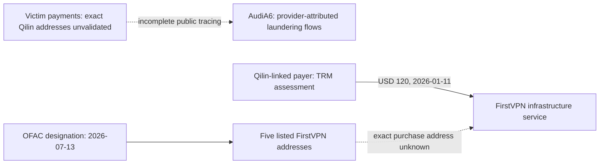

# Qilin — Blockchain and Financial Intelligence

## What the Public Evidence Supports

Qilin's service monetizes encryption and non-publication pressure through affiliate-mediated extortion. Historical advertised affiliate shares are documented in [operations](operations.md); they are not an audited view of actual treasury accounting. This review validates **no direct Qilin victim-payment address**. RansomLook's dedicated cryptocurrency page returned no wallet, and no address was found in the reviewed Ransomware.live actor page. That is an inventory gap, not evidence that the operation receives no payments. [Q21](../References.md#q21), [Q02](../References.md#q02)

Two financial investigations do expose relevant **service relationships**: AudiA6 laundering and FirstVPN infrastructure purchases. Their purposes and evidence must remain distinct.

## AudiA6 — Reported Laundering Relationship

Europol announced disruption of AudiA6 on June 11, 2026, describing a service suspected of laundering more than EUR 336 million in 2022–2025. TRM separately attributes approximately **USD 7.1 million in flows to Qilin**, versus USD 386,200 to Akira, among many ransomware customers. The actor-level estimate comes from TRM, not an actor-by-actor Europol transaction exhibit. **Moderate Confidence** in Qilin use: specialist provider attribution, without a reproducible public graph here. [F04](../References.md#f04), [F03](../References.md#f03)

TRM also describes overlapping affiliate infrastructure between Qilin and other ransomware operations without identifying enough public transaction detail to resolve who controlled it. Plausible explanations include common affiliates, shared brokers or the same laundering service. **Low Confidence** in any stronger organizational inference. The EUR figure is neither funds seized nor Qilin revenue. No identified seizure address is added to the inventory.

## FirstVPN — Infrastructure Purchase, Not a Ransom Payment

OFAC designated **FIRST VPN SERVICE** on **2026-07-13** under **CYBER4**, alongside its administrator and a cryptor provider. The official service entry publishes five addresses on Bitcoin, Ethereum, Litecoin and TRON. TRM reports that Qilin sent **USD 120 on 2026-01-11** to FirstVPN. This is a provider-attributed operating expense for infrastructure, not a victim paying ransom or a treasury consolidation transfer. [F01](../References.md#f01), [F07](../References.md#f07), [F02](../References.md#f02)

**High Confidence** in OFAC's attribution of those identifiers to FirstVPN. **Moderate Confidence** in the service-level Qilin customer relationship. **Unknown** which listed address, transaction or blockchain corresponds to that specific USD 120 payment. The amount and date must not be copied into every address as an observed Qilin transfer.

TRM assesses that the five addresses appear located at **Cryptomus**. This is a custodial/service-location assessment, not an OFAC designation of Cryptomus or evidence Qilin controls the exchange. Custodial accounting can make the ultimate user and key holder different entities. [F02](../References.md#f02)

Solid and dotted relationships represent evidence states; they are not a reconstructed transaction graph. FirstVPN's purchase relationship and AudiA6's laundering relationship are separate branches, not an inferred continuous money trail.

## Multi-Chain and Treasury Gaps

Four networks are represented in the official FirstVPN inventory. That does **not** demonstrate Qilin ransom receipts on all four, or prove USDT/USDC use on Ethereum/TRON. Token movement requires transaction and contract-level evidence. No public basis was found here for copying Akira's WanChain/Defiway/Chainflip phases, two-wallet consolidation or HTX destination into Qilin.

The complete treasury, affiliate split locations, long-term reserves, peel chains, mixers, bridges and ultimate beneficiaries remain unvalidated. A mixer/exchange/bridge deposit may belong to a service or unrelated counterparty. **Victim payment address ≠ threat actor treasury wallet; on-chain relationship ≠ organizational attribution.**

## Official Review and Next Steps

The [dated shared review](../../financial-source-review.md) records full SDN XML screening and government/provider searches. No exact Qilin/Agenda/REVENANT SPIDER name match occurred in that snapshot; this is not evidence of no sanctioned affiliates. FirstVPN matched and its five addresses are in the [address register](../iocs/blockchain-addresses.md).

Prioritize a redacted payment instruction linked to an incident, transaction IDs behind AudiA6/Qilin attribution, the exact FirstVPN purchase path, and lawful provider/account records distinguishing customer deposits from key ownership. Preserve transaction time, asset units, network and conversion rates; do not add USD estimates across reports with different valuation dates.
